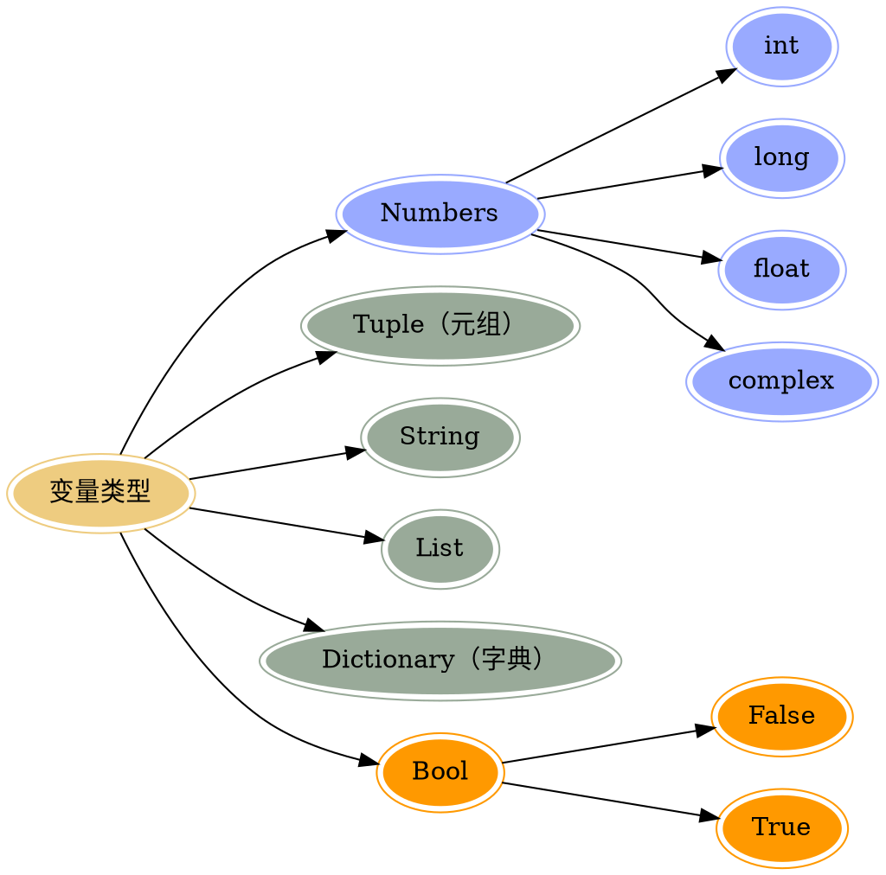

## 注释 <sup class="new">(new)</sup>

> `单行注释`

?>以#开头,#右边的所有东西当做说明，而不是真正要执行的程序，起辅助说明作用

```python
 # 我是注释，可以在里写一些功能说明之类的哦
    print('hello world')
```

> `多行注释`

```
'''我是多行注释，可以写很多很多行的功能说明
        这就是我牛X指出

        哈哈哈。。。
    '''

    '''
        下面的代码完成 ，打印一首诗
        名字叫做：春江花月夜
        作者，忘了
    '''
```

## 中文支持

!> 在 python2 中直接使用中文会报错

> 解决办法，在程序的开头写入如下代码

```
 #coding=utf-8
```

?> 注意：
在 python 的语法规范中推荐使用的方式:

```
# -*- coding:utf-8 -*-
```

> ?> :golf: python3 全面支持中文编码

## 变量以及类型

> 变量的定义

在程序中，有时我们需要对 2 个数据进行求和，那么该怎样做呢？

大家类比一下现实生活中，比如去超市买东西，往往咱们需要一个菜篮子，用来进行存储物品，等到所有的物品都购买完成后，在收银台进行结账即可如果在程序中，需要把 2 个数据，或者多个数据进行求和的话，那么就需要把这些数据先存储起来，然后把它们累加起来即可。

在 Python 中，存储一个数据，需要一个叫做变量的东西，如下示例:

```python
num1 = 100 #num1就是一个变量，就好一个小菜篮子
num2 = 87  #num2也是一个变量
result = num1 + num2 #把num1和num2这两个"菜篮子"中的数据进行累加，然后放到 result变量中
```

> 变量的类型



## 关键字

> 什么是关键字

python 一些具有特殊功能的标示符，这就是所谓的关键字
关键字，是 python 已经使用的了，所以不允许开发者自己定义和关键字相同的名字的标示符。

> 查看关键字: 可通过 `keywords.kwlist` 查看

```js
and     as      assert     break     class      continue    def     del
elif    else    except     exec      finally    for         from    global
if      in      import     is        lambda     not         or      pass
print   raise   return     try       while      with        yield
```
