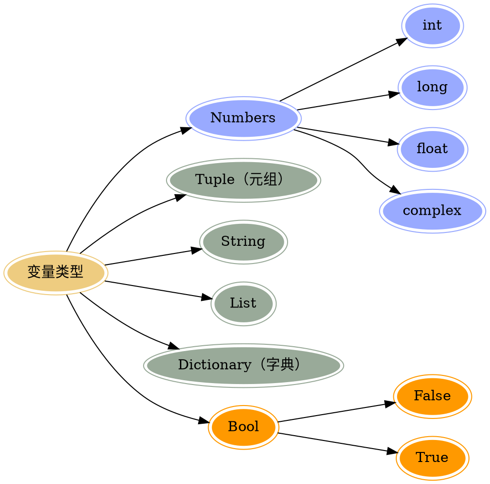

## 注释 <sup class="new">(new)</sup>

> `单行注释`

?>以#开头,#右边的所有东西当做说明，而不是真正要执行的程序，起辅助说明作用

```python
 # 我是注释，可以在里写一些功能说明之类的哦
    print('hello world')
```

> `多行注释`

```
'''我是多行注释，可以写很多很多行的功能说明
        这就是我牛X指出

        哈哈哈。。。
    '''

    '''
        下面的代码完成 ，打印一首诗
        名字叫做：春江花月夜
        作者，忘了
    '''
```

## 中文支持

!> 在 python2 中直接使用中文会报错

> 解决办法，在程序的开头写入如下代码

```
 #coding=utf-8
```

?> 注意：
在 python 的语法规范中推荐使用的方式:

```
# -*- coding:utf-8 -*-
```

> ?> :golf: python3 全面支持中文编码

## 变量以及类型

> 变量的定义

在程序中，有时我们需要对 2 个数据进行求和，那么该怎样做呢？

大家类比一下现实生活中，比如去超市买东西，往往咱们需要一个菜篮子，用来进行存储物品，等到所有的物品都购买完成后，在收银台进行结账即可如果在程序中，需要把 2 个数据，或者多个数据进行求和的话，那么就需要把这些数据先存储起来，然后把它们累加起来即可。

在 Python 中，存储一个数据，需要一个叫做变量的东西，如下示例:

```python
num1 = 100 #num1就是一个变量，就好一个小菜篮子
num2 = 87  #num2也是一个变量
result = num1 + num2 #把num1和num2这两个"菜篮子"中的数据进行累加，然后放到 result变量中
```

> 变量的类型



## 关键字

> 什么是关键字

python 一些具有特殊功能的标示符，这就是所谓的关键字
关键字，是 python 已经使用的了，所以不允许开发者自己定义和关键字相同的名字的标示符。

> 查看关键字: 可通过 `keywords.kwlist` 查看

```js
and     as      assert     break     class      continue    def     del
elif    else    except     exec      finally    for         from    global
if      in      import     is        lambda     not         or      pass
print   raise   return     try       while      with        yield
```

## 输入输出

> 输出

- 普通输出

```python
# 打印提示
    print('hello world')
    print('给我的卡---印度语，你好的意思')
```

- 格式化输出

```py
age = 10
name = "xiaohua"
print("我今%d岁%age)
print("我的姓名%s,年龄%d"%(name,age))
```

- 常用的格式符号

| 格式符号 |             转换              |
| :------: | :---------------------------: |
|    %c    |             字符              |
|    %s    | 通过 str() 字符串转换来格式化 |
|    %i    |       有符号十进制整数        |
|    %d    |       有符号十进制整数        |
|    %u    |       无符号十进制整数        |
|    %o    |          八进制整数           |
|    %x    |   十六进制整数（小写字母）    |
|    %X    |   十六进制整数（大写字母）    |
|    %e    |      索引符号（小写'e'）      |
|    %E    |      索引符号（大写“E”）      |
|    %f    |           浮点实数            |
|    %g    |       ％f 和％e 的简写        |
|    %G    |       ％f 和％E 的简写        |

<br>

- 换行输出

```py

print("1234567890-------") # 会在一行显示
print("1234567890\n-------") # 一行显示1234567890，另外一行显示-------
```

> 输入

?> 在 Python 中，获取键盘输入的数据的方法是采用 input() 函数; `python2 中 使用raw_input()`

```
password = input("请输入密码:")
print '您刚刚输入的密码是:', password
```

## 运算符

> 算术运算符

| 运算符 |  描述  |                                   实例                                    |
| :----: | :----: | :-----------------------------------------------------------------------: |
|   -    |   加   |                      两个对象相加 a + b 输出结果 30                       |
|   -    |   减   |             得到负数或是一个数减去另一个数 a - b 输出结果 -10             |
|   \*   |   乘   |      两个数相乘或是返回一个被重复若干次的字符串 a \* b 输出结果 200       |
|   /    |   除   |                         x 除以 y b / a 输出结果 2                         |
|   //   | 取整除 |         返回商的整数部分 9//2 输出结果 4 , 9.0//2.0 输出结果 4.0          |
|   %    |  取余  |                      返回除法的余数 b % a 输出结果 0                      |
|  \*\*  |   幂   | 返回 x 的 y 次幂 a\*\*b 为 10 的 20 次方， 输出结果 100000000000000000000 |

> 赋值运算符

| 运算符 |    描述    |                           实例                           |
| :----: | :--------: | :------------------------------------------------------: |
|   =    | 赋值运算符 | 把=号右边的结果给左边的变量 num=1+2\*3 结果 num 的值为 7 |

> 复合赋值运算符

| 运算符 |       描述       |             实例              |
| :----: | :--------------: | :---------------------------: |
|   +=   |  加法赋值运算符  |    c += a 等效于 c = c + a    |
|   -=   |  减法赋值运算符  |    c -= a 等效于 c = c - a    |
|  \_=   |  乘法赋值运算符  |   c \_= a 等效于 c = c \* a   |
|   /=   |  除法赋值运算符  |    c /= a 等效于 c = c / a    |
|   %=   |  取模赋值运算符  |    c %= a 等效于 c = c % a    |
| \*\*=  |   幂赋值运算符   | c \*\*= a 等效于 c = c \*\* a |
|  //=   | 取整除赋值运算符 |   c //= a 等效于 c = c // a   |

> 逻辑运算符

| 运算符 | 逻辑表达式 |                                  描述                                   |          实例           |
| :----: | :--------: | :---------------------------------------------------------------------: | :---------------------: |
|  and   |  x and y   | 布尔"与" - 如果 x 为 False，x and y 返回 False，否则它返回 y 的计算值。 |   (a and b) 返回 20。   |
|   or   |   x or y   |     布尔"或" - 如果 x 是 True，它返回 True，否则它返回 y 的计算值。     |   (a or b) 返回 10。    |
|  not   |   not x    | 布尔"非" - 如果 x 为 True，返回 False 。如果 x 为 False，它返回 True。  | not(a and b) 返回 False |

> 比较运算符

?> 和 javascript 中的一样

## 常用的数据类型转换

|          函数          |                         说明                          |
| :--------------------: | :---------------------------------------------------: |
|    int(x [,base ])     |                  将 x 转换为一个整数                  |
|    long(x [,base ])    |                 将 x 转换为一个长整数                 |
|       float(x )        |                 将 x 转换到一个浮点数                 |
| complex(real [,imag ]) |                     创建一个复数                      |
|        str(x )         |                 将对象 x 转换为字符串                 |
|        repr(x )        |              将对象 x 转换为表达式字符串              |
|       eval(str )       | 用来计算在字符串中的有效 Python 表达式,并返回一个对象 |
|       tuple(s )        |                将序列 s 转换为一个元组                |
|        list(s )        |                将序列 s 转换为一个列表                |
|        chr(x )         |               将一个整数转换为一个字符                |
|       unichr(x )       |             将一个整数转换为 Unicode 字符             |
|        ord(x )         |              将一个字符转换为它的整数值               |
|        hex(x )         |          将一个整数转换为一个十六进制字符串           |
|        oct(x )         |           将一个整数转换为一个八进制字符串            |

<br>
